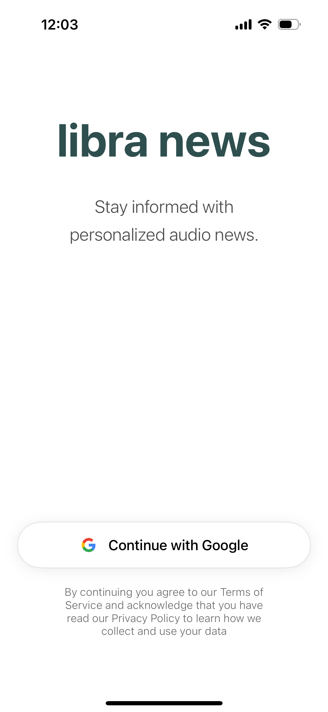

# libra news

Personalized audio news. A SwiftUI app that summarizes selected articles into 60-second audio clips and organizes them into custom playlists.

<div style="display: flex; justify-content: center; gap: 10px; margin-bottom: 20px;">
  
  
  
  
</div>

<div style="display: flex; justify-content: center; gap: 10px;">
  
  
  
  
</div>

## Features

- Firebase Authentication 
- Fetching news from NewsAPI and filtering by topics
- Summarization of articles using OpenAI API
- Creating audio clips using OpenAI TTS and ElevenLabs
- Audio playback 

## Requirements

- iOS 15.0+
- Xcode 13.0+
- NewsAPI Key
- OpenAI API Key
- ElevenLabs API Key (Optional)

## Setup

1. Clone the repository
```bash
git clone https://github.com/khamitov527/libranews.git
```

2. Add your api keys 
- Create `Secrets.swift`
```
enum Secrets {
    static let newsAPIKey = "API-KEY-GOES-HERE"
    static let openaiAPIKey = "API-KEY-GOES-HERE"
    static let elevenLabsAPIKey = "API-KEY-GOES-HERE"
}

```
- Add GoogleService-Info.plist file with Firebase credentials.

## License

This project is licensed under the MIT License - see the LICENSE file for details
